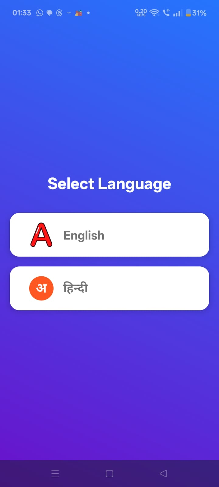
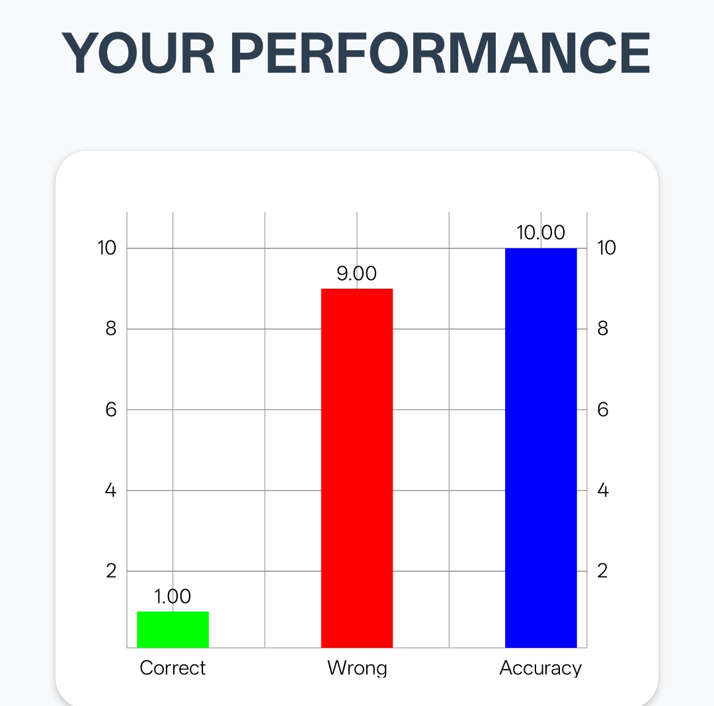
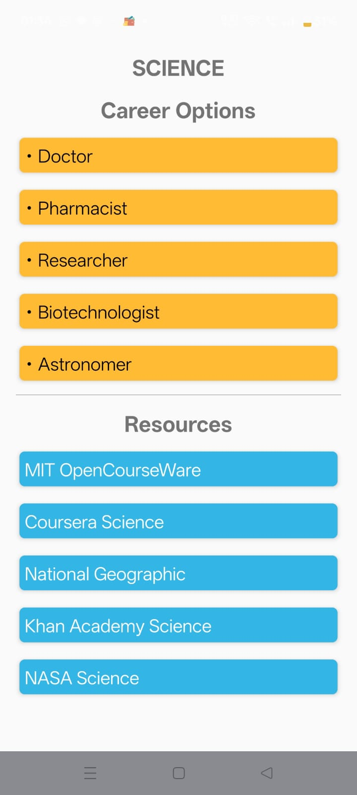

# 🚀 DreamRoot – Stream & Career Guidance App

Discover your ideal stream with AI-powered quiz & career guidance.

---

## 📌 About the Project

DreamRoot is an Android application designed to help students identify the most suitable academic stream (**Science, Commerce, Arts, Maths**) based on their interests and performance in an interactive quiz system.

The app uses structured logic and AI-assisted suggestions to guide students toward better career decisions along with curated learning resources.

---

## ✨ Features Overview

DreamRoot includes multiple intelligent modules working together as a complete guidance system:

- Stream selection based on interest analysis  
- Interactive MCQ-based quiz system  
- Real-time progress tracking  
- Bilingual support (English + Hindi)  
- Detailed performance analytics  
- AI-based career recommendations  
- Curated external learning resources  

Each module is designed to work independently while contributing to the final career prediction system.

---

## 🧠 Core Functional Modules

### 🎯 Stream Finder
Analyzes user preferences and suggests the most suitable academic stream using quiz-based evaluation logic.

---

### ❓ Interactive Quiz System
Provides a structured MCQ-based assessment with real-time progress tracking and multilingual support.

---

### 📊 Performance Analysis
Generates detailed insights including:
- Correct answers  
- Incorrect answers  
- Accuracy percentage  

---

### 🧭 Career Suggestions
Recommends career paths based on user performance:
Doctor, Pharmacist, Researcher, Biotechnologist, Astronomer, and more.

---

### 📚 Learning Resources
Provides access to top educational platforms:
MIT OpenCourseWare, Coursera, Khan Academy, NASA, National Geographic.

---

### 🌐 Language Support
Supports both English and Hindi for wider accessibility and improved user experience.

---

## 📸 App Screenshots

### 🏠 Main Interface


---

### 🌐 Language Selection (Bilingual Support)


---

### 📊 Performance Dashboard


---

### 🧑‍🎓 Career Recommendation Screen


---

## 🛠️ Tech Stack

- **Programming Language:** Java  
- **UI Framework:** XML + Material Design  
- **IDE:** Android Studio  
- **Charts Library:** MPAndroidChart  
- **AI Integration:** Gemini API  

---

## ⚙️ Installation Guide

Clone this repository:

```bash
git clone https://github.com/jain-2706/Dream_Route_App.git
